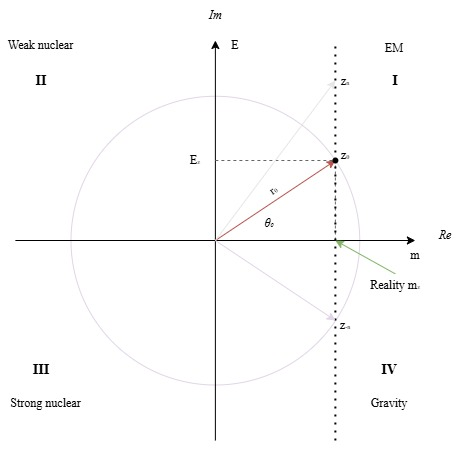

# Chapter 1: The Complex Plane

The connection between the complex plane and reality becomes especially significant when we consider the origins and applications of imaginary numbers. Historically, the introduction of imaginary numbers emerged from attempts to solve cubic equations, as first systematically explored by [Gerolamo Cardano](https://en.wikipedia.org/wiki/Gerolamo_Cardano) in the 16th century. Cardano discovered that even when all solutions to a cubic equation were real, the algebraic process sometimes required passing through intermediate steps involving the square roots of negative numbers—quantities that had no clear interpretation at the time.

This mathematical curiosity turned out to be much more than a formal trick. The development of complex numbers enabled mathematicians and physicists to describe phenomena that could not be captured by real numbers alone. A profound example is the discovery of electromagnetic waves. In the 19th century, James Clerk Maxwell formulated his famous equations, which describe how electric and magnetic fields propagate and interact. The solutions to Maxwell's equations are most naturally expressed using complex exponentials, where the imaginary unit $i$ encodes oscillatory behavior—essential for describing wave phenomena such as light and radio waves ([see Maxwell's equations](https://en.wikipedia.org/wiki/Maxwell%27s_equations)).

Thus, imaginary numbers are not merely abstract constructs; they are indispensable tools for modeling and understanding the physical world. Their use reveals that reality possesses layers and symmetries that extend beyond direct sensory perception, hinting at a deeper mathematical structure underlying the universe. The complex plane, therefore, is not just a mathematical convenience but a window into the hidden fabric of nature.

The complex plane, a mathematical construct that allows us to visualize complex numbers as points in a two-dimensional space. In this plane, the horizontal axis represents the real numbers, while the vertical axis represents the imaginary numbers. For our purposes, we will map **mass** onto the real axis and **energy** onto the imaginary axis. Why this choice? Well, mass seems more real than energy from my point of view (feel free to swap). With this picture in mind, let's pick a point $z_0$ on the complex plain and dive into its possible implications.

Figure 1: $m_z$ is what we perceive at time $\theta_0$ and space $r_0$.

<a href="./PREFACE.md" style="float:left">&lt;&lt; Preface</a><a href="./CHAPTER2.md" style="float:right">Chapter 2: Polar Representation and Its Implications &gt;&gt;</a>
