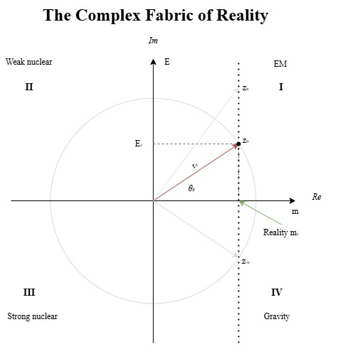

# The Mathematical Fabric of Reality

This work in progress pindaric flight explores **E**nergy, **M**ass, **T**ime and **S**pace in the complex plane.

Figure 1: $m_z$ is what we perceive at time $\theta_0$ and space $r_0$. 

- [Preface](./PREFACE.md)
- [Chapter 1: The Complex Plane](./CHAPTER1.md)
- [Chapter 2: Polar Representation and its Implications](./CHAPTER2.md)
- [Chapter 3: The Quadrants and their Implications](./CHAPTER3.md)
- [Chapter 4: Reality as a Mapping](./CHAPTER4.md)
- [Chapter 5: Quantum Analogy](./CHAPTER5.md)
- [Chapter 6: Mathematical Interactions and Reality](./CHAPTER6.md)
- [Conclusion](./CONCLUSION.md)